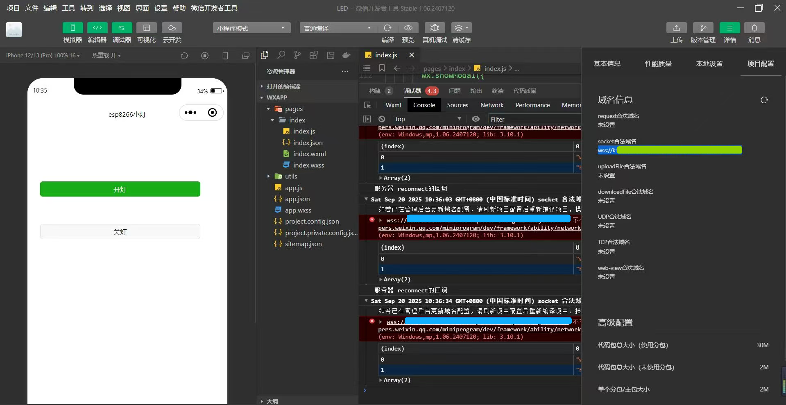
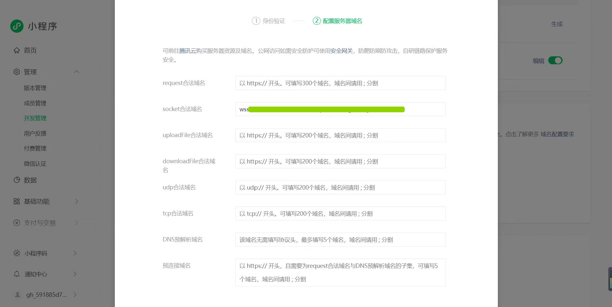
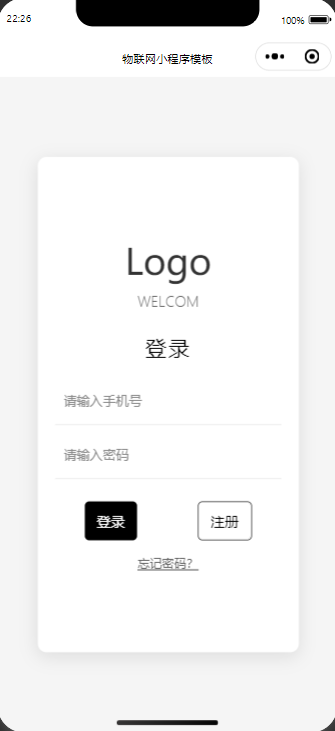
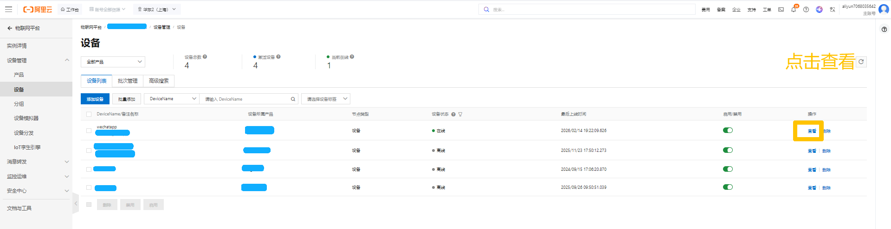
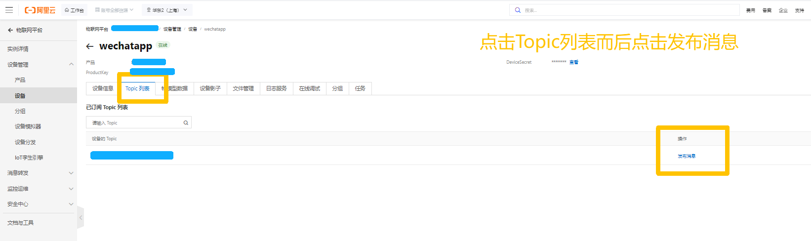
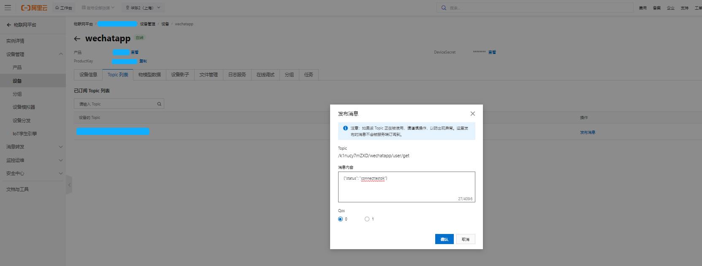
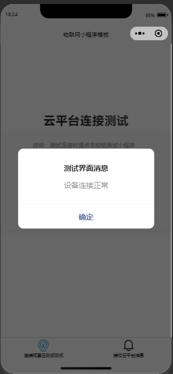
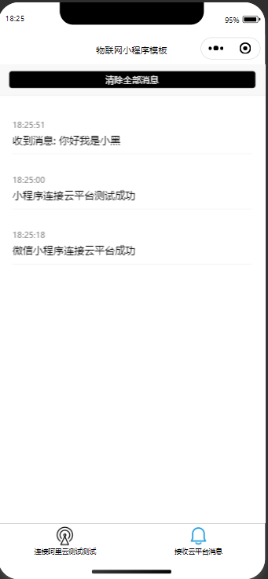

# 🚀 微信小程序 · 阿里云物联网平台通用模板

> 告别重复造轮子，一键接入阿里云，让您的物联网创意快速落地！

### 🙏 特别鸣谢

本文的代码基于B站UP主栈小满_XMP的教程 **《毕设：STM32+ESP8266-01S+阿里云+微信小程序 实现智能家居》** 拓展，呈上栈小满_XMP老师的视频教程：[点击观看教程](https://www.bilibili.com/video/BV1aw411y7Kp/?spm_id_from=333.337.search-card.all.click&vd_source=495d4c74bf598b3a22917e898f335430)

---

### 📖 简介

在嵌入式开发的学习与实践中，每当使用WiFi或4G模块时，往往离不开云平台的支持。然而，单纯的硬件上云只是第一步，真正让项目 **“好玩”** 起来的，通常是一个能实时交互的上位机。 **微信小程序** 因其上手难度低、开发效率高，成为了不错的上位机方案。但每次都要重复编写小程序连接阿里云物联网平台的代码，不仅繁琐且效率低下。

秉持 **不重复造轮子** 的宗旨，我从上一个项目写的小程序中整理、精简出这套 **可轻松移植的通用模板程序**。它封装了小程序与阿里云之间的核心通信逻辑，如MQTT连接、消息订阅/发布、离线消息处理等功能，旨在帮助开发者从重复的基础工作中解放出来，只需简单配置，即可快速搭建属于自己的物联网应用，**让创意更快落地！** ✨

---

### ⭐ 本项目亮点

|        | 亮点                   | 描述                                                         |
| :----: | :--------------------- | :----------------------------------------------------------- |
| **01** | 🎯 **统一配置管理**     | 所有配置集中在 `config.js`，一次配置全局生效，移植只需修改一个文件 |
| **02** | 📡 **全局消息订阅系统** | 实现发布-订阅模式，支持多页面同时接收消息，自动管理订阅生命周期 |
| **03** | 💾 **离线消息处理**     | 自动保存离线期间消息，页面重新加载时自动恢复，**不丢失任何消息** |
| **04** | 🧠 **智能消息解析**     | 支持多种消息格式自动识别（系统消息、业务消息、定位信息等），可扩展的消息类型映射 |
| **05** | 🔗 **连接状态持久化**   | 测试状态在页面切换和后台运行时自动保存和恢复，用户体验流畅   |
| **06** | 🔄 **自动重连机制**     | MQTT客户端支持自动重连，网络恢复后自动重新连接和订阅         |
| **07** | 📶 **网络状态检测**     | 连接前自动检测网络状态，提供友好的错误提示                   |
| **08** | 📦 **消息数量限制**     | 自动限制消息列表数量（200条），防止内存溢出，保持应用性能    |

---

### 📁 项目核心文件目录树

```
TempleWXAppForIOT/
├── 🛠️ .idea/                   # IDE配置文件夹（可忽略）
├── 🎨 icon/                     # 图标资源目录
│   ├── connect_black.png        # 连接图标（未选中）
│   ├── connect_blue.png         # 连接图标（已选中）
│   ├── message_black.png        # 消息图标（未选中）
│   └── message_blue.png         # 消息图标（已选中）
├── 📱 pages/                     # 页面文件夹
│   ├── index/                    # 连接测试页面
│   │   ├── index.js              # 页面逻辑
│   │   ├── index.json            # 页面配置
│   │   ├── index.wxml            # 页面结构
│   │   └── index.wxss            # 页面样式
│   ├── login/                    # 登录页面
│   │   ├── login.js              # 页面逻辑
│   │   ├── login.json            # 页面配置
│   │   ├── login.wxml            # 页面结构
│   │   └── login.wxss            # 页面样式
│   └── message/                  # 消息接收页面
│       ├── message.js            # 页面逻辑
│       ├── message.json          # 页面配置
│       ├── message.wxml          # 页面结构
│       └── message.wxss          # 页面样式
├── 🛠️ utils/                      # 工具类目录
│   ├── aliyun/                   # 阿里云相关工具
│   │   ├── aliyun_connect.js     # 阿里云连接参数生成
│   │   └── hex_hmac_sha1.js      # HMAC-SHA1加密算法
│   ├── mqtt.js                    # MQTT客户端库
│   └── util.js                    # 通用工具函数
├── 🧩 app.js                       # 小程序主入口
├── ⚙️ app.json                     # 小程序全局配置
├── 🎨 app.wxss                     # 全局样式
├── 🔑 config.js                    # 【统一配置文件-必改】
├── ⚙️ project.config.json          # 公共标准配置文件
├── 🔒 project.private.config.json  # 私有项目配置文件
├── 🗺️ sitemap.json                 # 站点地图配置
└── 👁️ .gitignore                   # Git忽略文件
```

---

## 📦 移植说明

### 01 环境准备 🌱

下载并安装 [微信开发者工具](https://developers.weixin.qq.com/miniprogram/dev/devtools/download.html)，建议使用最新稳定版本。

### 02 阿里云物联网平台准备和代码必改部分 🔑

1. 注册阿里云账号并开通物联网平台服务。
2. 创建一个产品并在产品下创建一个设备，记录 **阿里云三元组** 等信息。

> 📺 **关于阿里云的操作**：可以参考B站UP主栈小满_XMP老师的视频教程  
> [点击观看](https://www.bilibili.com/video/BV1nZ4y1n7dE/?spm_id_from=333.1387.homepage.video_card.click&vd_source=495d4c74bf598b3a22917e898f335430)

在本模板中，阿里云配置文件已单独封装到 `config.js` 文件中，使用时仅需修改此处信息：

```javascript
const config = {
  // 阿里云配置：请登录阿里云平台查看并在下方补全
  aliyun: {
    productKey: '填写你的产品密钥',      // 产品唯一标识（在"产品详情"页查看）
    deviceName: '填写你的设备名称',       // 设备名称（在"设备列表"中查看）
    deviceSecret: '填写你的设备密钥',      // 设备密钥（创建设备时生成，请妥善保管）
    regionId: '填写服务地域ID',           // 服务地域（通常可以用cn-shanghai等）
    pubTopic: '填写发布消息的主题',        // 小程序发布消息给设备的Topic
    subTopic: '填写订阅消息的主题',        // 小程序接收设备消息的Topic
  },
```

> 💡 **与栈小满老师原教程的区别**  
> 老师提到的 **初次订阅使用的代码片段**，本模板已将其封装到 `app.js` 文件中的 `initMQTT()` 函数。您无需如老师的教程代码那样使用一次后注释掉这部分代码，因为本模板已优化了订阅机制：**MQTT连接仅在初始化时订阅一次**，所有页面通过消息广播系统共享同一个订阅，无需重复订阅，也不会造成资源浪费。

---

### 03 小程序项目导入 📲

完成01和02两个步骤后，您可以将本项目导入到您的微信开发者工具中。

在导入项目后您在编译运行时可能遇到报错

```
wss://您的产品…… 不在以下 socket 合法域名列表中，请配置域名...
```

这是笔者之前遇到的一个问题，大致是说小程序正在尝试连接阿里云MQTT的WebSocket地址（ `ws://...` ），但这个域名没有配置在小程序的 **“socket合法域名”** 中。

**解决方法：**

1. 点击 **“详情”**，复制这个socket合法域名



2. 登录 [小程序后台](https://mp.weixin.qq.com/)，使用您的账号登录
3. 进入 **“开发” → “开发管理” → “开发设置”**
4. 在 **“服务器域名”** 板块中，找到 **“socket合法域名”** 一项
5. 点击 **“修改”** 按钮，将您的 WebSocket 域名添加进去
6. 回到小程序重新编译即可



---

### 04 直接运行程序 ▶️

成功编译运行后您会首先看到小程序的 **登录界面**，当前小程序的登录界面暂未设定用户名和密码绑定和验证逻辑，您可以直接点击登录按钮进入小程序。如果您需要登录验证等功能，可以自行开发后端逻辑实现与小程序配合使用。



登录成功后，您将自动进入 **云平台连接测试页**。

在此页面点击 **“运行通信测试”** 按钮，小程序会主动向阿里云发送一条 `{"status": "connecttest"}` 的测试消息。测试阶段您需要在界面的30秒倒计时内通过阿里云物联网控制台向小程序发送 `{"status": "connecttestok"}` 消息。

> ✍️ **特别说明**：您在阿里云控制台发送的回复消息，实际上是模拟**物联网设备端**向小程序下发消息的过程。如果后续您在产品下创建了多个设备，还可以通过配置发布/订阅主题，实现设备与小程序之间的双向通信，方便进行更丰富的功能测试和开发。

**通过阿里云向小程序发送消息的方法：**

| 步骤 | 操作                          |
| :--: | :---------------------------- |
|  ①   | 进入物联网平台控制台          |
|  ②   | 选择您的产品，点击“Topic列表” |
|  ③   | 选择订阅主题，点击“发布消息”  |






点击确认后回到小程序，您会看到 **“设备连接正常”** 的成功弹窗



您也可以通过云平台发送其余JSON格式的消息，当前程序的消息解析规则如下：

| 发送的消息格式                      | 解析结果                     |    状态    |
| :---------------------------------- | :--------------------------- | :--------: |
| `{ "message": "您的任何消息内容" }` | `收到消息：您的任何消息内容` |  ✅ 可解析  |
| `{ "status": "connecttestok" }`     | `小程序连接云平台测试成功`   |  ✅ 可解析  |
| `{ "status": "其他的内容" }`        | `收到无法解析的消息...`      | ❌ 无法解析 |
| `{ "others": "其他的东东" }`        | `收到无法解析的消息...`      | ❌ 无法解析 |



---

### 05 代码可选修改说明 🔧

阅读该部分您可以对照参考前面的核心文件目录树。

#### 📱 页面的创建与修改

如果你想要新建一个页面，可以右键 `pages` 文件夹，选择 **新建 Page**，这样你会得到一个新的文件夹，其中自动包含四个文件：

| 文件    | 作用     |
| :------ | :------- |
| `.js`   | 页面逻辑 |
| `.wxml` | 页面结构 |
| `.wxss` | 页面样式 |
| `.json` | 页面配置 |

> ⚠️ **特别注意**：添加页面后要在 `app.json` 的 `pages` 字段添加页面路径，没有注册的界面是无法使用的

```json
"pages": [
  "pages/login/login",
  "pages/index/index",
  "pages/message/message"
]
```

**页面搭建速成思路**（以在界面居中的红色界面跳转按钮为例）：

1. **结构文件 (`.wxml`)**：放置一个按钮组件
2. **样式文件 (`.wxss`)**：定义按钮的位置（居中）和颜色（红色）
3. **逻辑文件 (`.js`)**：编写按下按钮跳转页面的逻辑
4. **绑定**：将按钮组件与跳转逻辑绑定

> 📚 **推荐资源**：具体代码编写可参考 [微信开发者官方文档](https://developers.weixin.qq.com/miniprogram/dev/devtools/download.html)，其中涵盖大量可轻松移植和使用的示例代码。

#### 🖼️ 外部图标和图片的添加

本模板使用 `icon` 文件夹专门存放小程序所需要的图标，目前该文件夹下已经放置了底部栏所需的图标。使用时可直接通过相对路径访问图标：

```json
"tabBar": {
  "list": [
    {
      "iconPath": "icon/connect_black.png",   // 默认时显示的图标
      "selectedIconPath": "icon/connect_blue.png" // 点击后显示的图标
    }
  ]
}
```

同理，如果需要添加图片，您可以在 `icon` 文件夹同一级目录新建 `picture` 文件夹专门用于图片的放置。

#### ✉️ 特殊消息的解析

`message` 页面是一个接收云平台消息的示例代码，您可以根据需要扩展解析逻辑：

```javascript
processMessagePayload(payload, timestamp) {
  try {
    console.log("解析消息payload:", payload);
    const parsedMsg = typeof payload === 'string' ? JSON.parse(payload) : payload;

    // 1. 连接测试成功消息（特殊处理）
    if (parsedMsg.status === 'connecttestok') {
      this.pushSystemMsg("小程序连接云平台测试成功", timestamp);
      return;
    }

    // 2. 提取并显示消息内容（message字段）
    const msgContent = parsedMsg.message;
    if (msgContent) {
      this.pushMsg(`收到消息: ${msgContent}`, timestamp, {
        type: 'parsed',
        original: parsedMsg
      });
      return;
    }

    // 👇 在这里扩展您的自定义消息解析逻辑 👇
    // 示例：解析温度数据
    // if (parsedMsg.temperature) {
    //   this.pushMsg(`🌡️ 当前温度: ${parsedMsg.temperature}°C`, timestamp);
    //   return;
    // }

    // 3. 无法解析的消息
    this.pushMsg(`收到无法解析的消息: ${JSON.stringify(parsedMsg)}`, timestamp, {
      type: 'unparsed',
      original: parsedMsg
    });

  } catch (error) {
    console.error("消息解析错误:", error);
    this.pushMsg(`收到无法解析的消息: ${payload}`, timestamp, { type: 'unparsed' });
  }
},
```

---

### 📜 开源许可证

本项目采用 **MIT 许可证** 开源，随便用，随便玩~

如果您在使用过程中遇到任何问题，或有任何改进建议，欢迎联系作者🎉

